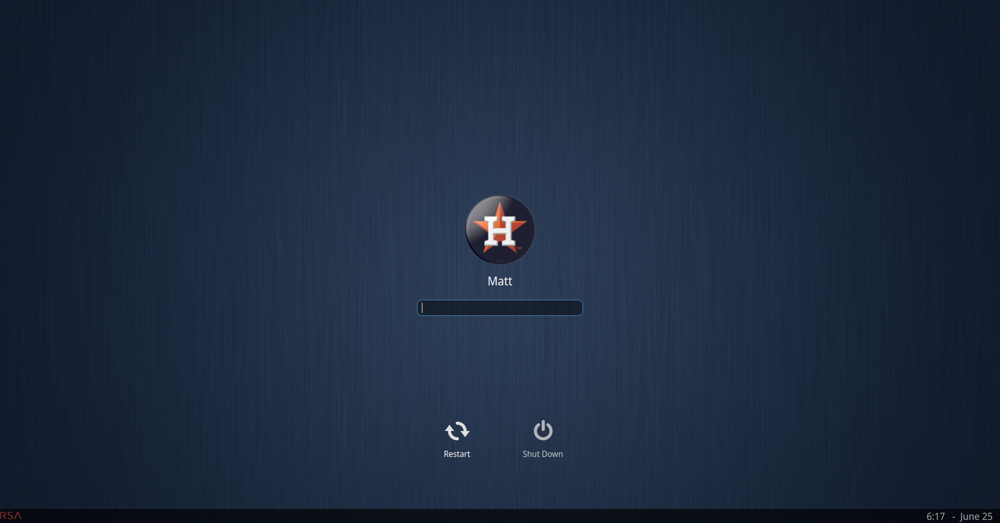

# SDDM login manager themes 


Config for xorg to get SDDM proper focus for password field
# location /etc/X11/xorg.conf.d/10-monitor.conf
``` Section "Monitor"
Identifier  "HDMI-1"
Option      "Primary"  "true"
Option      "Enable"   "true"
Option      "PreferredMode" "1920x1080x60.0"
EndSection
Section "Monitor"
Identifier  "HDMI-3"
Option      "RightOf" "HDMI-1"
Option      "Primary"  "false"
Option      "Disable"  "false"
Option      "Enable"   "true"
Option      "PreferredMode" "1920x1080x60.0"
EndSection
```
